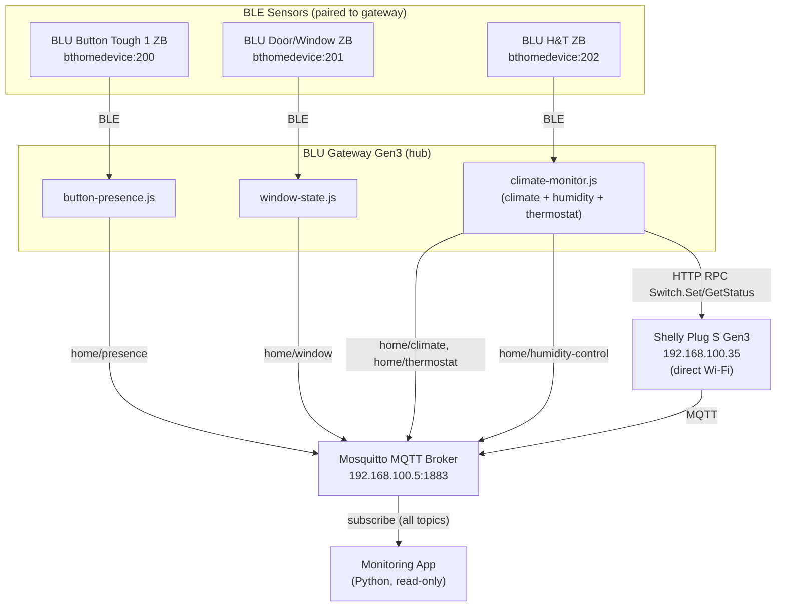

# Shelly Smart Home System

Smart home automation system built on the Shelly BLU ecosystem —
thermostat, presence detection, window state machine and automatic
humidity control.

All business logic runs **on the BLU Gateway Gen3 itself** as on-device
scripts. No cloud services and no logic in the desktop application: the
gateway decides, publishes state to a local MQTT broker, and the
monitoring app is a read-only consumer of that stream.

## Task status

The eleven tasks below are the assignment verbatim, in its original
order and numbering. The full task text is in
[docs/00-overview.md](docs/00-overview.md).

| # | Task | Status | Where |
|---|---|---|---|
| 1 | Create a Shelly profile, or use an existing one | Done | [docs/03-pairing-guide.md](docs/03-pairing-guide.md) |
| 2 | All provided devices added and configured in the Shelly profile | Done | [docs/01-devices.md](docs/01-devices.md), [docs/03-pairing-guide.md](docs/03-pairing-guide.md) |
| 3 | Each device assigned a clearly defined role | Done | [docs/01-devices.md](docs/01-devices.md) |
| 4 | Thermostat using the ready-made Shelly components | Done — logical signal | [docs/06-thermostat.md](docs/06-thermostat.md), [ADR-0005](adr/0005-thermostat-as-logical-signal.md), [ADR-0006](adr/0006-thermostat-cooling-mode.md) |
| 5 | Presence detection using the Bluetooth button | Done | [docs/04-presence.md](docs/04-presence.md), [ADR-0002](adr/0002-use-button-as-presence-token.md) |
| 6 | Door/window sensor: all three states of a single-leaf window | Done | [docs/05-window-state.md](docs/05-window-state.md) |
| 7 | Business logic implemented and stored on the hub, using the button | Done | [scripts/gateway/](scripts/gateway/), [ADR-0001](adr/0001-hub-centric-business-logic.md) |
| 8 | Automatic humidity control (hub + Plug S + H&T sensor) | Done | [docs/07-humidity-control.md](docs/07-humidity-control.md) |
| 9 | GitHub repository holding everything developed for these tasks | Done | [docs/](docs/), [diagrams/](diagrams/), [adr/](adr/), [images/](images/) |
| 10 | Progress documented in clear, logically separated commits, repository structure first | Done | [CHANGELOG.md](CHANGELOG.md) |
| 11 | Monitoring application visualizing data from all devices | Done | [app/](app/) |

## Hardware

| Device | Role | Connectivity |
|---|---|---|
| BLU Gateway Gen3 | Hub — runs all business logic | Wi-Fi + BLE |
| BLU Button Tough 1 ZB | Presence token (single press toggles home/away) | BLE via gateway |
| BLU Door/Window ZB | Window state: closed / tilted / open | BLE via gateway |
| BLU H&T ZB | Temperature, humidity, battery | BLE via gateway |
| Shelly Plug S Gen3 | Humidity control actuator | Wi-Fi (direct, not via gateway) |

MQTT broker: a local Mosquitto instance on the LAN. Credentials are
never stored in this repository — see [app/README.md](app/README.md).

## Architecture



The gateway allows a **hard maximum of three concurrently running
scripts**, which is why climate monitoring, humidity control and the
thermostat live in one combined script rather than three
([ADR-0004](adr/0004-consolidate-climate-scripts.md)).

### Gateway scripts

| Script | Responsibility | Publishes |
|---|---|---|
| [button-presence.js](scripts/gateway/button-presence.js) | Presence toggle on button press, persisted in KVS, mirrored to `boolean:200` | `home/presence` |
| [window-state.js](scripts/gateway/window-state.js) | Combines contact and tilt into a 3-state window machine | `home/window` |
| [climate-monitor.js](scripts/gateway/climate-monitor.js) | Climate readings, humidity control, thermostat | `home/climate`, `home/humidity-control`, `home/thermostat` |

Details and gotchas: [scripts/README.md](scripts/README.md).


### Scenarios

Leaving home while a window is open sends a push notification. The
condition is evaluated on the gateway — [button-presence.js](scripts/gateway/button-presence.js)
reads the window classification that [window-state.js](scripts/gateway/window-state.js)
persists in KVS, and calls an IFTTT webhook only when the notification
is warranted. The IFTTT applet holds no logic; it just delivers the
message to a phone that is no longer on the LAN. See
[docs/11-notifications-and-scenarios.md](docs/11-notifications-and-scenarios.md)
and [ADR-0007](adr/0007-ifttt-notification-in-cloud.md).

## Diagrams

Mermaid sources live in [diagrams/](diagrams/). The architecture diagram
above is the rendered version of `architecture.mmd`.

| Diagram | Shows |
|---|---|
| [architecture.mmd](diagrams/architecture.mmd) | Full system topology: sensors, gateway scripts, broker, app, and the direct HTTP path to the Plug S |
| [presence-state-machine.mmd](diagrams/presence-state-machine.mmd) | Home/Away toggle driven by `single_push`, and what each transition publishes |
| [window-state-machine.mmd](diagrams/window-state-machine.mmd) | Closed / Tilted / Open transitions, including the asynchronous arrival of contact and rotation |
| [thermostat-logic.mmd](diagrams/thermostat-logic.mmd) | Mode selection (Off / Heating / Cooling), hysteresis deadband, and the resulting demand decision |
| [humidity-control-logic.mmd](diagrams/humidity-control-logic.mmd) | Hysteresis thresholds, anti-short-cycle cooldown, and the stale-data fail-safe |
| [away-window-notification.mmd](diagrams/away-window-notification.mmd) | The Away notification scenario: the KVS window check on the hub, and the webhook out to IFTTT |

## MQTT topics

All topics are published with `retain=true`, so a subscriber that
connects late immediately receives the current state.

| Topic | Payload |
|---|---|
| `home/presence` | `{"present": bool, "ts": int}` |
| `home/window` | `{"state": "closed" / "tilted" / "open", "ts": int}` |
| `home/climate` | `{"temperature": float, "humidity": float, "battery": float, "ts": int}` |
| `home/humidity-control` | `{"plug_on": bool, "ts": int}` |
| `home/thermostat` | `{"mode": "off"/"heating"/"cooling", "setpoint": float, "heating_demand": bool, "current_temp": float, "ts": int}` |

### Control logic

The two closed loops are configured differently on purpose. The
humidity thresholds below are **hard-coded constants** in
[climate-monitor.js](scripts/gateway/climate-monitor.js); the
thermostat setpoint and mode are **virtual components the user edits
in the Shelly app** at runtime. One subsystem demonstrates each
approach — see [ADR-0008](adr/0008-two-configuration-approaches.md).

| Behavior | Thresholds |
|---|---|
| Humidity control | Plug on at 60% RH and above, off at 55% RH and below (hysteresis) |
| Anti short-cycle | Minimum 180 s between plug switches |
| Stale-data fail-safe | Plug forced off if no reading for 600 s |
| Thermostat — heating | Demand on below `setpoint - 0.5 °C`, off above `setpoint + 0.5 °C` |
| Thermostat — cooling | The inverse: demand on above `setpoint + 0.5 °C`, off below `setpoint - 0.5 °C` |
| Thermostat — off | Demand forced off; the setpoint is preserved, not reset |

### Virtual components on the gateway

Created through the gateway web UI (Components → Create new); the
`Boolean.Create` and `Number.Create` RPC methods are unavailable on
this firmware.

| Component | Name | Purpose |
|---|---|---|
| `boolean:200` | Home/Away | Presence state, visible in the Shelly app |
| `number:200` | Thermostat Setpoint | Target temperature, editable in the app |
| `boolean:201` | Heating Demand | Read-only thermostat output (means cooling demand in cooling mode) |
| `boolean:202` | Thermostat HEATING | Mode toggle, mutually exclusive with COOLING |
| `boolean:203` | Thermostat COOLING | Mode toggle, mutually exclusive with HEATING |

## Repository layout

```
adr/       architecture decision records
app/       Python monitoring application (CustomTkinter + paho-mqtt)
diagrams/  Mermaid diagrams of the architecture and the control logic
docs/      project documentation
images/    screenshots and photos
scripts/   gateway scripts (mJS, run on the BLU Gateway Gen3)
```

## Getting started

### 1. Broker

Run a Mosquitto instance on the LAN with username/password
authentication enabled. On Windows, running it from a `.bat` script is
more reliable than installing it as a service — see
[docs/02-network-setup.md](docs/02-network-setup.md) and
[docs/09-troubleshooting.md](docs/09-troubleshooting.md).

### 2. Gateway scripts

Pair the BLU devices with the gateway
([docs/03-pairing-guide.md](docs/03-pairing-guide.md)), then upload each
file from [scripts/gateway/](scripts/gateway/) to the gateway
(Scripts → Add script) and enable auto-start so the script survives a
reboot:

```bash
curl -X POST -d '{"id":1,"method":"Script.SetConfig","params":{"id":1,"config":{"enable":true}}}' http://<gateway-ip>/rpc
```

Pressing "Start" in the web UI is not enough — it only affects the
current session.

### 3. Monitoring application

```bash
cd app
cp .env.example .env      # then set MQTT_PASSWORD
pip install -r requirements.txt
python main.py
```

Full configuration reference: [app/README.md](app/README.md).

## Screenshots


## Documentation

| Document | Covers |
|---|---|
| [00-overview.md](docs/00-overview.md) | Task text, provided devices, architecture summary |
| [01-devices.md](docs/01-devices.md) | Device inventory, identifiers, and roles |
| [02-network-setup.md](docs/02-network-setup.md) | Network layout and Mosquitto broker setup |
| [03-pairing-guide.md](docs/03-pairing-guide.md) | Pairing the BLU devices with the gateway |
| [04-presence.md](docs/04-presence.md) | Presence detection design and behavior |
| [05-window-state.md](docs/05-window-state.md) | Three-state window detection |
| [06-thermostat.md](docs/06-thermostat.md) | Thermostat logic and virtual components |
| [07-humidity-control.md](docs/07-humidity-control.md) | Automatic humidity control |
| [08-testing-plan.md](docs/08-testing-plan.md) | Test plan and recorded results |
| [09-troubleshooting.md](docs/09-troubleshooting.md) | Problems encountered and their fixes |
| [10-future-improvements.md](docs/10-future-improvements.md) | Out-of-scope ideas and known rough edges |
| [11-notifications-and-scenarios.md](docs/11-notifications-and-scenarios.md) | Cross-device scenarios and the IFTTT notification |

### Architecture decision records

| ADR | Decision |
|---|---|
| [0001](adr/0001-hub-centric-business-logic.md) | Business logic runs on the gateway, not in the cloud or the app |
| [0002](adr/0002-use-button-as-presence-token.md) | BLU Button used as an explicit presence token |
| [0003](adr/0003-mqtt-over-http-polling.md) | MQTT chosen over HTTP polling |
| [0004](adr/0004-consolidate-climate-scripts.md) | Climate, humidity control, and thermostat consolidated into one script |
| [0005](adr/0005-thermostat-as-logical-signal.md) | Thermostat implemented as a logical heating-demand signal |
| [0006](adr/0006-thermostat-cooling-mode.md) | Cooling mode via two mutually-exclusive mode toggles |
| [0007](adr/0007-ifttt-notification-in-cloud.md) | Phone notifications via IFTTT, outside the hub |
| [0008](adr/0008-two-configuration-approaches.md) | Hard-coded config for humidity control, user input for the thermostat |

## Known limitations

- The thermostat drives no physical actuator, in either heating or
  cooling mode — the hardware includes no heating relay or TRV, and the
  only controllable actuator is allocated to humidity control. See
  [ADR-0005](adr/0005-thermostat-as-logical-signal.md).
- The demand flag is published as `heating_demand` in both modes; in
  cooling mode a true value means cooling demand. Consumers must read
  `mode` alongside it — see [ADR-0006](adr/0006-thermostat-cooling-mode.md).
- Presence is an explicit button toggle, not passive BLE proximity — a
  deliberate choice, see [ADR-0002](adr/0002-use-button-as-presence-token.md).
- The UI shows current values only, with no history or graphs.
- The Away notification depends on internet access and on IFTTT. A
  failed webhook is logged on the gateway and never retried, so the
  notification is simply lost — see
  [docs/11-notifications-and-scenarios.md](docs/11-notifications-and-scenarios.md).
- The IFTTT webhook URL is a credential, so the committed
  [button-presence.js](scripts/gateway/button-presence.js) carries a
  placeholder and the real URL lives only on the gateway. Uploading the
  file to the device therefore overwrites the working URL — see
  [docs/11-notifications-and-scenarios.md](docs/11-notifications-and-scenarios.md).
