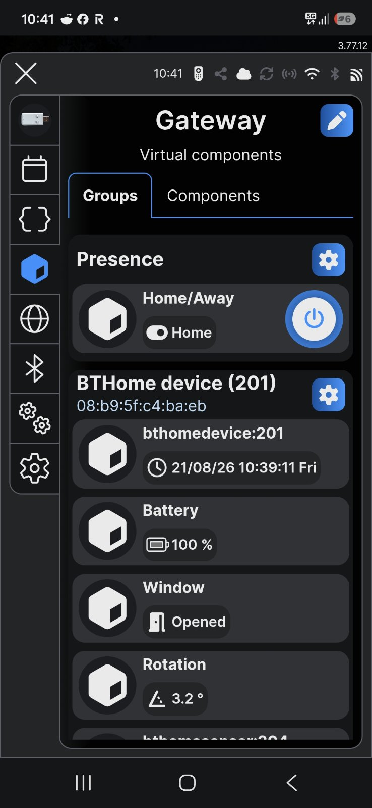
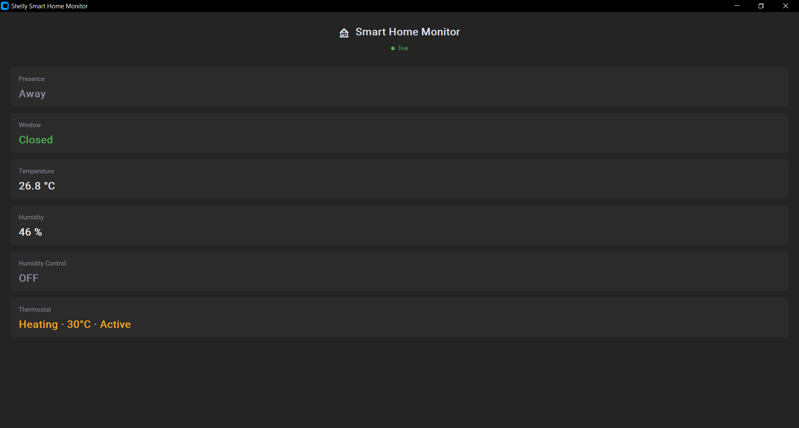

# Presence Detection

## Approach

Presence is tracked via explicit BLU Button presses, not passive BLE
proximity. See `adr/0002-use-button-as-presence-token.md` for the
full rationale, including why a passive "last seen" fallback was
considered and rejected for v1.

## Implementation

Handled entirely by `scripts/gateway/button-presence.js`, running on
the BLU Gateway Gen3.

- A single press on the BLU Button Tough 1 ZB (`bthomedevice:200`)
  toggles the presence state.
- State is persisted via KVS (key `presence_state`), surviving
  gateway reboots.
- Published to MQTT topic `home/presence` (retained):
  `{"present": true|false, "ts": <unix timestamp>}`
- Mirrored to a virtual boolean component (`boolean:200`, "Home/Away")
  visible directly in the Shelly Smart Control app.

## Behavior notes

- On the Away transition the script reads the window state from KVS
  and fires an IFTTT webhook if the window is not closed — see
  `docs/11-notifications-and-scenarios.md` and `adr/0007-*`.
- Only `single_push` events trigger a toggle. Double/triple/long press
  are not currently used for presence (available for future use).
- On gateway reboot, the script must have `config.enable = true` to
  auto-start — see `docs/09-troubleshooting.md`.
- State correctly resumes from the last known value after a reboot
  (verified: KVS persists across `Shelly.Reboot`).

The state as the monitoring app renders it:

