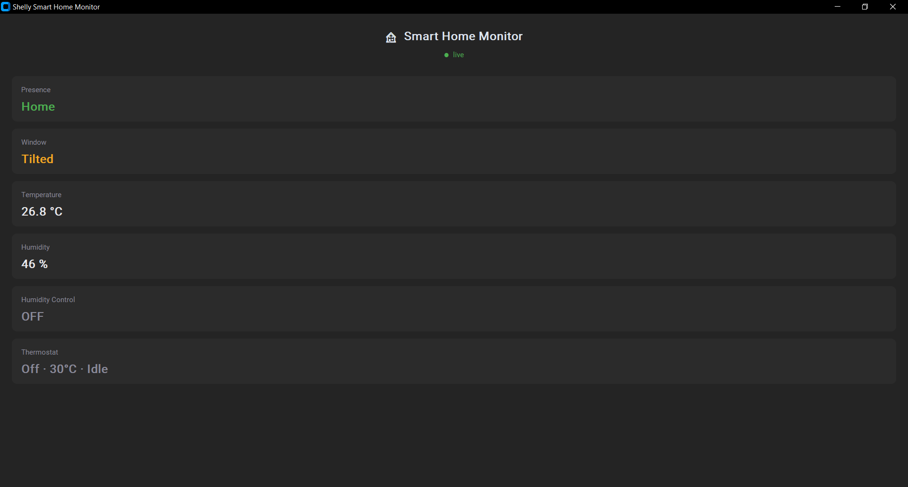
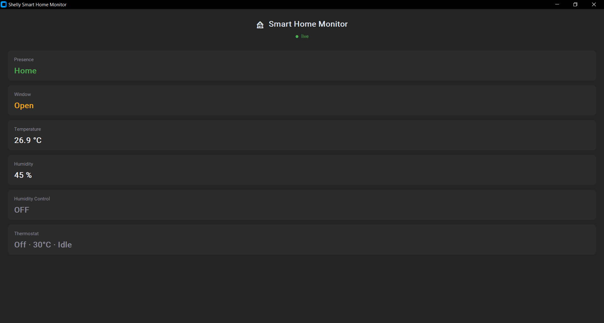

# Window State Detection (3 states)

## Approach

Detects three states of a single-leaf window — closed, open, tilted —
by combining two BTHome sensor components from the BLU Door/Window ZB
(`bthomedevice:201`):

- `bthomesensor:202` — contact state (true = open, false = closed)
- `bthomesensor:203` — tilt angle in degrees

The device firmware itself resolves the "tilted vs fully open"
question via a configurable angle threshold: angles below the
threshold report as 0° (fully open, not tilted), and the classification
logic simply reads that resolved value — no on-device angle math is
needed on the gateway side.

Classification:

contact = false → closed
contact = true, rotation = 0 → open
contact = true, rotation != 0 → tilted

The two non-closed states as the monitoring app renders them:

## Async event handling

Contact and rotation status changes arrive asynchronously — rotation
typically reports ~2 seconds after contact, while the device's
accelerometer settles (per manufacturer documentation). The script
tracks both last-known values and re-evaluates on every status change
from either sensor, rather than deciding from a single event alone —
otherwise a tilt would be briefly misclassified as fully open.

## Implementation

`scripts/gateway/window-state.js`, using `Shelly.addStatusHandler`
(not `addEventHandler` — these are continuous sensor status changes,
not discrete events, see `docs/09-troubleshooting.md`).

Published to MQTT topic `home/window` (retained):
`{"state": "closed"|"open"|"tilted", "ts": <unix timestamp>}`

State is persisted via KVS (key `window_state`), surviving gateway
reboots.

The KVS value is not just persistence — it is also how
`button-presence.js` learns the window state. The Away notification
scenario reads it at the moment of the transition (see
`docs/11-notifications-and-scenarios.md`). Renaming the key would
silently break that scenario.

The derived state is not mirrored to a virtual component, so it is not
visible in the Shelly app the way presence is — see
`docs/10-future-improvements.md`.

## Reference

[Shelly BLU Door/Window ZB — Technical Documentation](https://shelly-api-docs.shelly.cloud/docs-ble/Devices/BLU_ZB/dw_ZB)