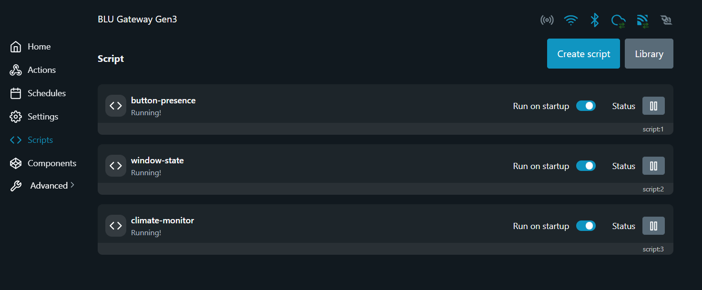

# Troubleshooting

## Script does not survive gateway reboot

**Symptom:** after rebooting the gateway, button presses no longer
trigger MQTT messages, even though the script worked before the reboot.

**Cause:** starting a script via the "Start" button in the web UI does
not persist across reboots. The script's `enable` config flag must be
set to `true` explicitly.

**Fix:**

```bash
curl -X POST -d '{"id":1,"method":"Script.SetConfig","params":{"id":1,"config":{"enable":true}}}' http://<gateway-ip>/rpc
```

Verify with:

```bash
curl -X POST -d '{"id":1,"method":"Script.GetConfig","params":{"id":1}}' http://<gateway-ip>/rpc
```

All three scripts correctly configured, with "Run on startup" enabled:




## Script state desyncs from physical device after restart

**Symptom:** humidity control logic doesn't trigger, even though the
humidity clearly crosses the configured threshold.

**Cause:** the script tracked the plug's on/off state in an in-memory
variable (`plugIsOn`), initialized to `false` on every script restart.
If the plug was physically on (e.g. from a previous test) but the
script restarted, the variable no longer matched reality — both the
"turn on" and "turn off" conditions failed silently, since each checks
the in-memory flag before acting.

**Fix:** seed the in-memory state from the actual device status via
`Switch.GetStatus` on script start, not just from KVS or an assumed
default.

## Monitoring app updates once, then freezes

**Symptom:** the app starts, fills in every card once, and then never
updates again. The connection indicator still shows "live", and the
gateway is demonstrably still publishing (confirmed with
`mosquitto_sub`).

**Cause:** a changed MQTT payload shape. The thermostat script was
extended with a cooling mode and started publishing `mode` instead of
`enabled`; the app's `decode()` still read `data["enabled"]` and raised
`KeyError`. Two things then combined to make it look like a freeze
rather than a crash:

- `MqttClient._handle_message` caught only `UnicodeDecodeError` and
  `JSONDecodeError`, so the `KeyError` propagated out.
- paho's `loop_forever()` catches only `OSError`, so the exception
  escaped the network thread and killed it. The traceback went to
  stderr from `threading.excepthook` and was easy to miss.

The retained messages arrive in subscription order, so the four topics
before `home/thermostat` rendered normally — hence "updates once".
The connection indicator was lit by a fixed `root.after(800, ...)`
timer, so it kept claiming the app was live.

**Fix:** three separate changes, all in the app:

- `decode()` reads `mode` and falls back to the legacy `enabled` field,
  so a stale retained message from before the change still decodes.
- `_handle_message` guards both the decode and the UI callback, logs
  the failure, and drops only that message.
- the connection indicator is driven by the real paho connect and
  disconnect callbacks instead of a timer.

**Lesson:** whenever a gateway script's payload changes, the app's
decoder is a breaking change waiting to happen. The guard means the
next such change costs one topic, not the whole stream.
